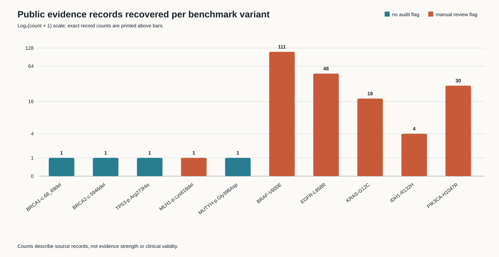

# ReproVar

[](https://doi.org/10.5281/zenodo.21901950)

[Project website](https://sneakypeat.github.io/reprovar/) · [Archived release](https://doi.org/10.5281/zenodo.21901951)

**An auditable mini-benchmark for public cancer-variant evidence retrieval**

ReproVar retrieves frozen public records for ten representative cancer variants, normalises provenance and review fields, and flags evidence that needs manual review. Five germline variants are drawn from ClinVar; five somatic variants are evaluated through accepted CIViC evidence items.

The project addresses a narrow question: **Can a compact, reproducible workflow recover and clearly expose public evidence for representative hereditary-cancer and precision-oncology variants?**

## What it demonstrates

- Germline and somatic evidence retrieval from official public APIs.
- HGVS-aware variant manifests and stable source identifiers.
- Preservation of disease, therapy, review status, evidence level, PubMed identifier and evaluation date.
- Frozen JSON snapshots with SHA-256 integrity checks.
- Deterministic TSV and Markdown reports, an audit figure and automated QC tests.
- An SOP that separates evidence aggregation from clinical interpretation and sign-out.

## Results

The versioned result is [`reports/evidence_audit.md`](reports/evidence_audit.md). Machine-readable outputs are in [`reports/evidence_matrix.tsv`](reports/evidence_matrix.tsv) and [`reports/audit_summary.tsv`](reports/audit_summary.tsv).



## Reproduce locally

ReproVar uses only the Python standard library at runtime.

```bash
git clone https://github.com/Sneakypeat/reprovar.git
cd reprovar
python -m unittest discover -s tests -v
PYTHONPATH=src python -m reprovar.cli analyse
```

Refresh the public snapshots and rebuild the analysis:

```bash
PYTHONPATH=src python -m reprovar.cli all
```

The refresh command requires internet access. It respects anonymous API rate limits and records a UTC retrieval timestamp. Because public interpretations change, refreshed results may differ from the release snapshot.

## Repository map

```text
data/variants.tsv          benchmark definition
data/raw/                  frozen source responses and checksums
src/reprovar/cli.py        retrieval, normalisation, QC and reporting
reports/                   versioned results and figure
docs/SOP.md                evidence-review workflow
docs/METHODS.md            design and analytical methods
docs/DATA_DICTIONARY.md    output field definitions
tests/                     integrity and schema checks
```

## Intended use and safety boundary

This project is for research, training and portfolio demonstration. It uses no patient or protected health information. It does **not** apply ACMG/AMP criteria, assign new AMP/ASCO/CAP tiers, diagnose disease, recommend treatment or replace review in an accredited clinical laboratory. Public database assertions are source evidence, not independent clinical conclusions.

## Data sources

- [ClinVar](https://www.ncbi.nlm.nih.gov/clinvar/) records are accessed through NCBI E-utilities. ClinVar submission data are freely available for any use.
- [CIViC](https://civicdb.org/) accepted evidence items are accessed through its GraphQL API. CIViC knowledgebase data are dedicated to the public domain under CC0 1.0.

Source data remain subject to the source organisations' terms and disclaimers. Code and original documentation in this repository are released under the MIT Licence.

## Citation

Please cite the archived software release using [`CITATION.cff`](CITATION.cff): [doi:10.5281/zenodo.21901951](https://doi.org/10.5281/zenodo.21901951).
